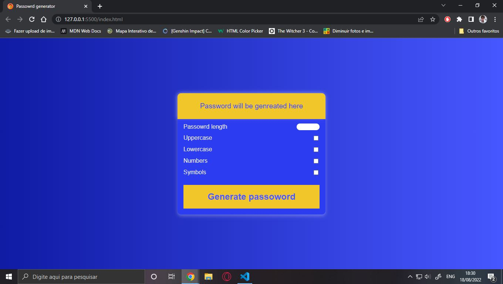
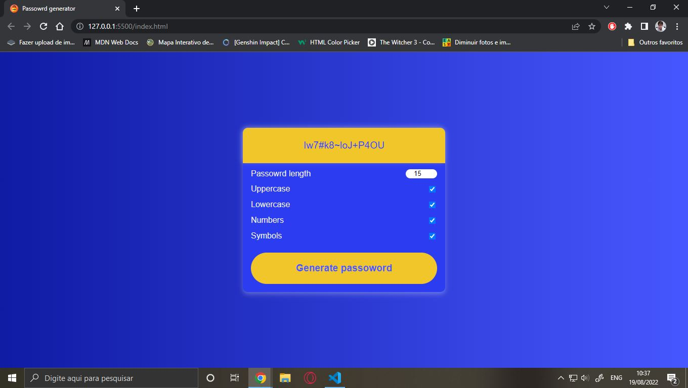

<h1 align = "center"> Hello guys! Welcome to my project. </h1>
 
<h2 align = "center"> In this project I made a Password Generator with JavaScript</h2>
 

With this generator, you can generate a powerful password with numbers, symbols, lower letters and upper letter.

 

 
 

 
